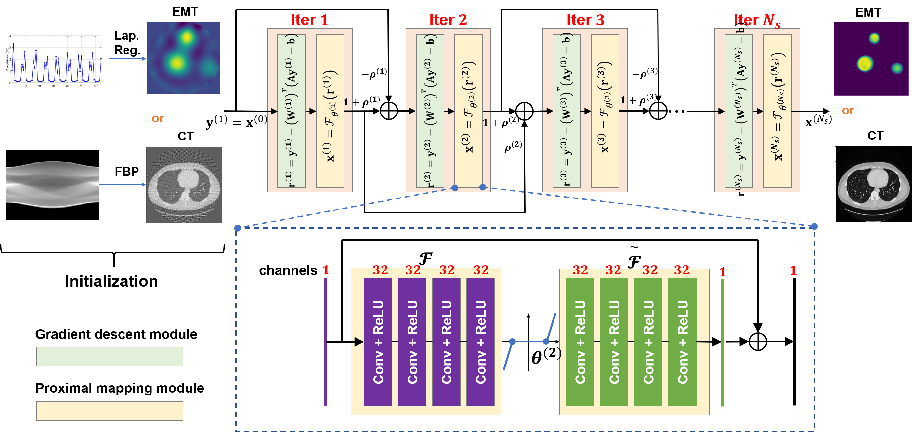

# Some revisions are being made in accord with the reviews of our paper. We will update the code soon. Thanks! (Jan. 12th, 2020)

# FISTA-Net
A model-based deep learning network for inverse problem in imaging

General Framework
----------

**Steps:**
* _Run 'CalculateW.m' to get the learned weights (refer to [Liu et al. 2019](https://github.com/VITA-Group/ALISTA));_
* _Competitive methods: 'M1LapReg.py', 'M2TV_FISTA.m', 'M3FBPConv.py', 'M4ISTANet.py';_
* _Proposed: 'M5FISTANet.py' (without learned matrix); 'M5FISTANetPlus.py' (with learned matrix);_

**Note**
These are example codes for the EMT experiment. As for sparse-view CT, additional libraries like the [radon transform operator](https://github.com/matteo-ronchetti/torch-radon) should be included. We will update this part after the full review of the paper if requested. 
